# TryHackMe — Wireshark: The Basics

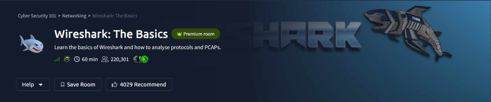

## Room Info

| | |
|---|---|
| **Room** | [Wireshark: The Basics](https://tryhackme.com/room/wiresharkthebasics) |
| **Path** | Cyber Security 101 → Networking → Wireshark: The Basics |
| **Difficulty** | Info / Beginner |
| **Time** | ~60 min |
| **Category** | Packet Analysis |

## Room Description

This room is a hands-on introduction to Wireshark — capture file properties, packet navigation and dissection, display filters, following streams, extracting embedded files, and using the Expert Information panel to spot anomalies in a `.pcapng` capture.

---

## Task — Getting Set Up: Two Capture Files

The room provides two capture files with different roles: one purely to visually simulate what the walkthrough screenshots show, and one that all questions are actually answered against.

**Q: Which file is used to simulate the screenshots?**
`http1.pcapng`

**Q: Which file is used to answer the questions?**
`Exercise.pcapng`

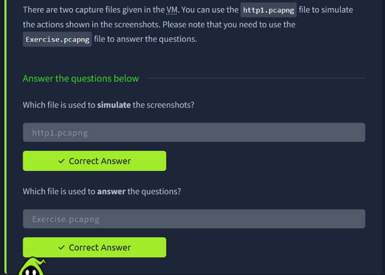

---

## Task — Capture File Properties

Wireshark's **Statistics → Capture File Properties** window surfaces metadata about a `.pcapng` file — hashes, packet counts, timing, and any embedded **capture file comments**, which can hold arbitrary notes (or, in a CTF-style room, a flag).

**Approach:** Opened `Exercise.pcapng` → Statistics → Capture File Properties, then scrolled to the **Capture file comments** section.

**Q: Read the "capture file comments". What is the flag?**

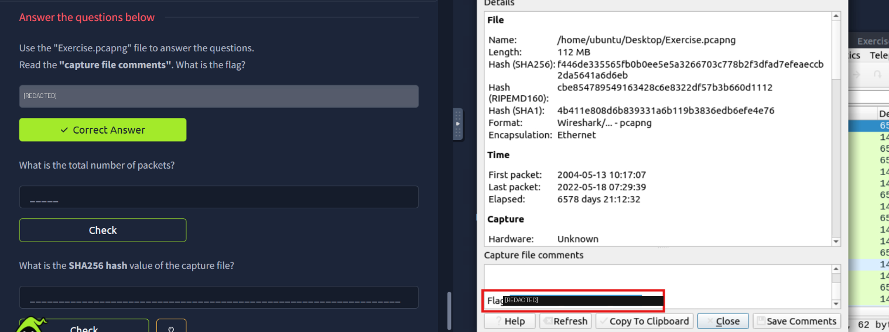

> 🚩 Flag value redacted — open the Capture File Properties dialog yourself and check the comments field to retrieve it.

**Q: What is the total number of packets?**
`58620`

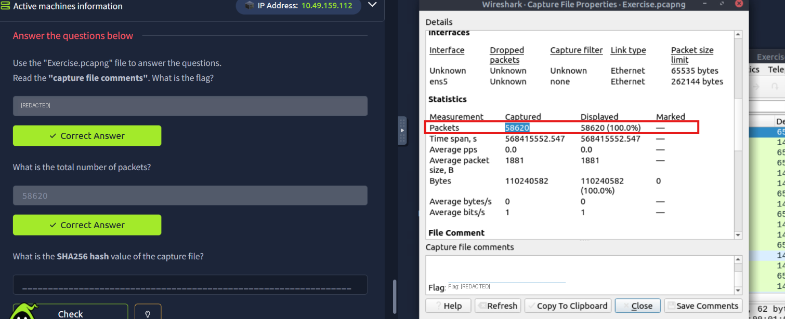

**Q: What is the SHA256 hash value of the capture file?**
`f446de335565fb0b0ee5e5a3266703c778b2f3dfad7efeaeccb2da5641a6d6eb`

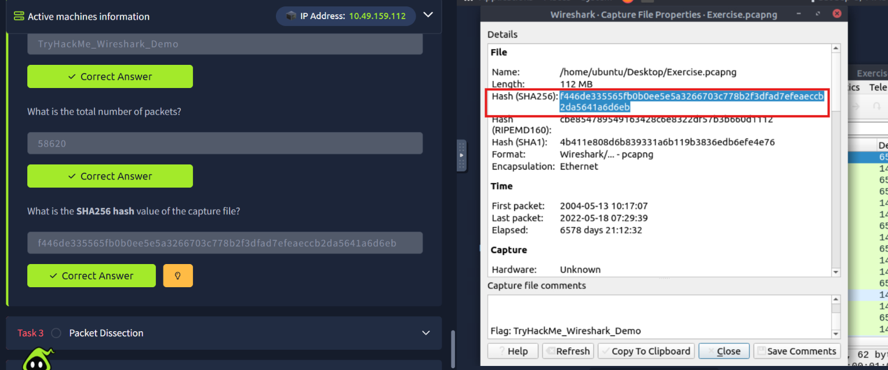

---

## Task — Packet Dissection

Drilling into a single packet's layers (Frame → Ethernet → IP → TCP → HTTP → payload) shows exactly how Wireshark breaks down each protocol layer, down to the raw hex bytes.

**Approach:** Opened packet **38** in `Exercise.pcapng` and expanded each protocol layer in the packet details pane.

**Q: View packet number 38. Which markup language is used under the HTTP protocol?**
`eXtensible Markup Language`

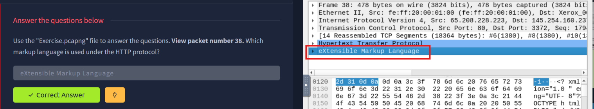

**Q: What is the arrival date of the packet?**
`05/13/2004`

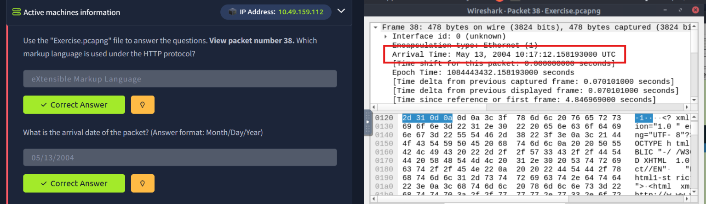

**Q: What is the TTL value?**
`47`

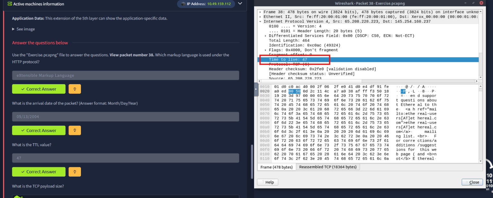

**Q: What is the TCP payload size?**
`424` bytes

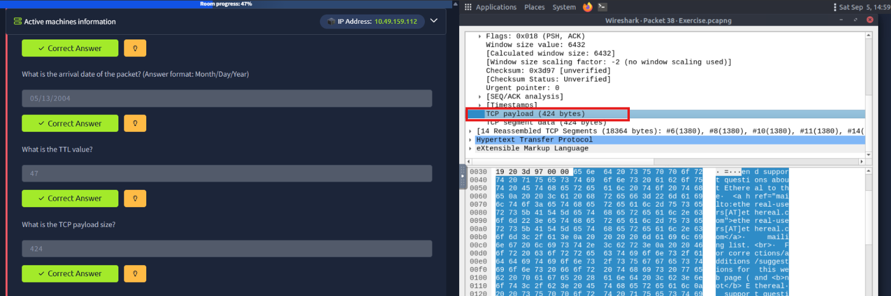

**Q: What is the e-tag value?**
`9a01a-4696-7e354b00`

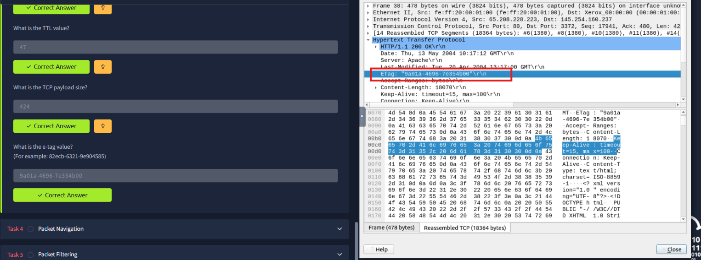

---

## Task — Packet Navigation & Searching

Wireshark's **Find Packet** feature (Ctrl+F) can search inside packet details — useful for locating a specific string buried in an HTTP response body.

**Approach:**
1. Searched for the string `r4w` under "Packet details" scope to locate the matching artist reference
2. Navigated to packet 12 and read its **packet comment** for a follow-up clue
3. Extracted an embedded JPEG from the capture and hashed it with `md5sum`
4. Found a `.txt` file embedded in the capture and read its contents

**Q: Search the "r4w" string in packet details. What is the name of artist 1?**
`r4w8173`

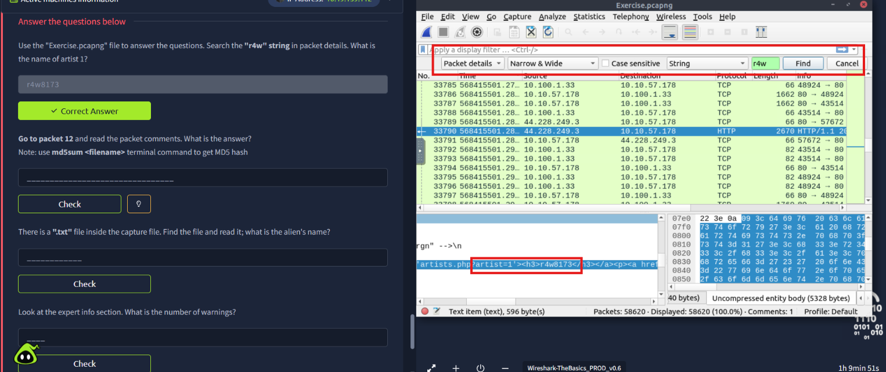

**Q: Go to packet 12 and read the packet comments. What is the answer?**
`911cd574a42865a956ccde2d04495ebf` — obtained by exporting the embedded JPEG's packet bytes and running `md5sum` on the extracted file.

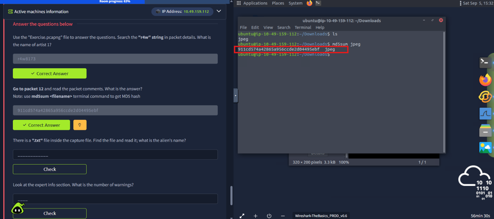

The packet 12 comment itself pointed to a specific packet number and gave instructions for exporting the image via the packet details pane.

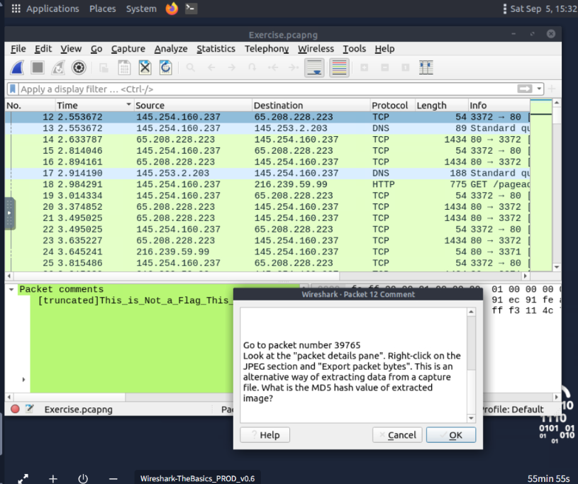

**Q: There is a ".txt" file inside the capture file. Find the file and read it; what is the alien's name?**
`PACKETMASTER` — recovered from a `note.txt` file embedded in the capture, found via the same file-carving approach and opened in a text editor.

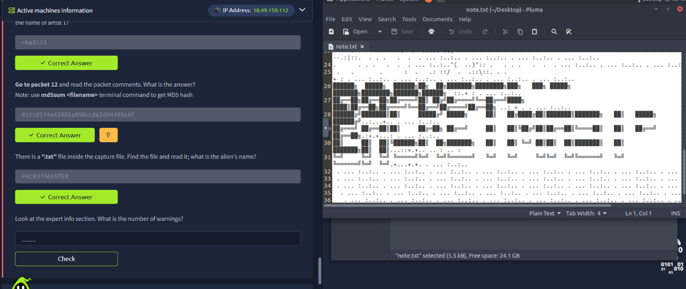

---

## Task — Packet Filtering & Expert Information

The **Expert Information** panel (Analyze → Expert Information) summarizes anomalies Wireshark flagged across the whole capture — warnings, errors, and notable protocol behavior — grouped by severity.

**Q: Look at the expert info section. What is the number of warnings?**
`1636`

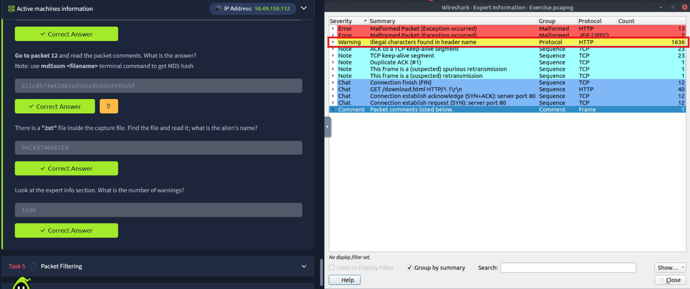

---

## Task — Display Filters & Following Streams

Right-clicking a protocol layer in the packet details pane and choosing **"Apply as Filter"** is the fastest way to build a display filter without typing it manually.

**Approach:**
1. Went to packet 4, right-clicked **Hypertext Transfer Protocol**, and applied it as a filter
2. Read the resulting filter query and the number of packets it matched
3. Navigated to packet 33790 and used **Follow → HTTP Stream** to read the full request/response conversation

**Q: Go to packet number 4. Right-click on "Hypertext Transfer Protocol" and apply it as a filter. What is the filter query?**
`http`

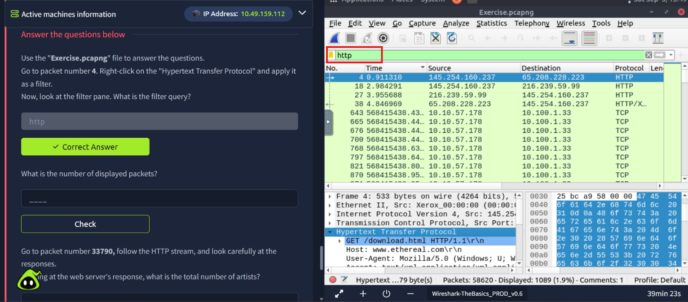

**Q: What is the number of displayed packets?**
`1089`

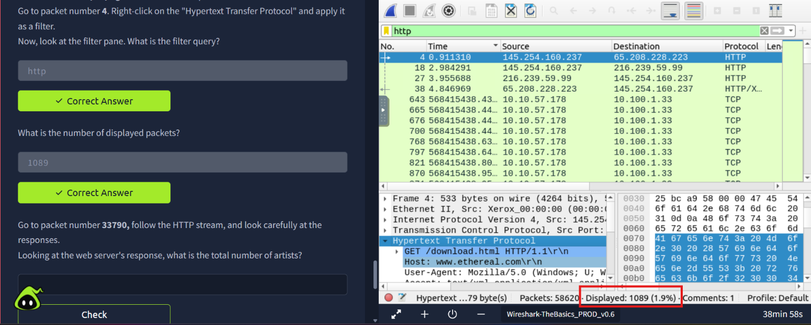

---

## Task — Following the HTTP Stream: Recovering Artist Names

Following the HTTP stream for packet 33790 reconstructed the full web server response — a demo "Acunetix" test site listing several **artist** entries, each rendered as a clickable link on the page.

**Q: Looking at the web server's response, what is the total number of artists?**
`3`

**Q: What is the name of the second artist?**
`Blad3`

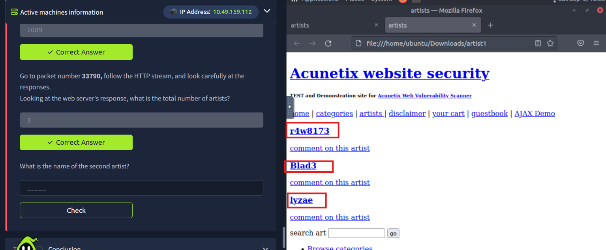

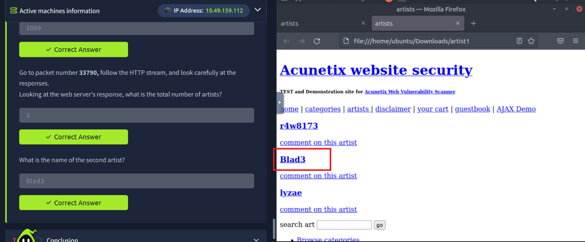

---

## Summary

| Task | Wireshark Feature | Key Skill |
|---|---|---|
| Capture file properties | Statistics → Capture File Properties | Reading hashes, packet counts, and embedded comments |
| Packet dissection | Packet details pane | Drilling into Frame → IP → TCP → HTTP → payload layers |
| Packet navigation | Find Packet (Ctrl+F) | Searching packet details for specific strings |
| File carving | Export Packet Bytes | Extracting embedded JPEGs/text files and hashing them |
| Expert Information | Analyze → Expert Information | Surfacing anomalies (warnings/errors) across a whole capture |
| Display filters | Right-click → Apply as Filter | Building filters directly from the packet details pane |
| Stream following | Follow → HTTP Stream | Reconstructing a full request/response conversation |

**Key takeaway:** This room built the core Wireshark workflow from the ground up — inspecting capture metadata, drilling into individual packet layers, searching and filtering at scale, carving out embedded files, and following streams to reconstruct application-level content. These are the exact same techniques used later for credential recovery and traffic-based forensics in more advanced rooms.

---
*Part of my [Cyber Security 101](https://tryhackme.com/path/outline/cybersecurity101) TryHackMe learning path.*
